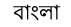
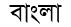
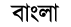
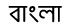
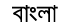

# Bangla Web Fonts

The aim of this project is making the web more beautiful, fast, and open through great Bengali typography with one of the fastest **Global CDN**. Currently, the following fonts are supported (though more fonts are coming soon):

- [AdorshoLipi](#adorsholipi)
- [AponaLohit](#aponalohit)
- [Bangla](#bangla)
- [BenSen](#bensen)
- [EkusheyLohit](#ekusheylohit)
- [Kalpurush](#kalpurush)
- [Mukti](#mukti)
- [SiyamRupali](#siyamrupali)
- [SolaimanLipi](#solaimanlipi)

## AdorshoLipi


Font Source: cgimagine

### Embed Font

To embed your selected fonts into a webpage, copy this code into the <head> of your HTML document.

#### STANDARD

```css
<link href="http://fonts.maateen.me/adorsho-lipi/font.css" rel="stylesheet">
```

#### IMPORT

```css
<style>
IMPORT url('http://fonts.maateen.me/adorsho-lipi/font.css');
</style>
```

### Specify in CSS

Use the following CSS rules to specify these families:

```css
font-family: 'AdorshoLipi', sans-serif;
```

#### Example

```css
p { 
    font-family: 'AdorshoLipi', Arial, sans-serif; 
}
```

## AponaLohit



AponaLohit is basically the Lohit font from Ekushey with additional hinting for better look on screen. This is some wthat Unicode equivalent of popular Boishakhi font. TrueType hintings have been initiated by Ershadul Haq and later improved by Alamigr Mohammed.

### Embed Font

To embed your selected fonts into a webpage, copy this code into the <head> of your HTML document.

#### STANDARD

```css
<link href="http://fonts.maateen.me/apona-lohit/font.css" rel="stylesheet">
```

#### IMPORT

```css
<style>
IMPORT url('http://fonts.maateen.me/apona-lohit/font.css');
</style>
```

### Specify in CSS

Use the following CSS rules to specify these families:

```css
font-family: 'AponaLohit', sans-serif;
```

#### Example

```css
p { 
    font-family: 'AponaLohit', Arial, sans-serif; 
}
```

## Bangla


Font Source: PfEd

### Embed Font

To embed your selected fonts into a webpage, copy this code into the <head> of your HTML document.

#### STANDARD

```css
<link href="http://fonts.maateen.me/bangla/font.css" rel="stylesheet">
```

#### IMPORT

```css
<style>
IMPORT url('http://fonts.maateen.me/bangla/font.css');
</style>
```

### Specify in CSS

Use the following CSS rules to specify these families:

```css
font-family: 'Bangla', sans-serif;
```

#### Example

```css
p { 
    font-family: 'Bangla', Arial, sans-serif; 
}
```

## BenSen



Developer: [Subrata Sen](http://www.subratasen.com/)

### Embed Font

To embed your selected fonts into a webpage, copy this code into the <head> of your HTML document.

#### STANDARD

```css
<link href="http://fonts.maateen.me/bensen/font.css" rel="stylesheet">
```

#### IMPORT

```css
<style>
IMPORT url('http://fonts.maateen.me/bensen/font.css');
</style>
```

### Specify in CSS

Use the following CSS rules to specify these families:

```css
font-family: 'BenSen', sans-serif;
```

#### Example

```css
p { 
    font-family: 'BenSen', Arial, sans-serif; 
}
```

## EkusheyLohit


Font Source: [Free Bangla Font Project](http://www.nongnu.org/freebangfont/)

### Embed Font

To embed your selected fonts into a webpage, copy this code into the <head> of your HTML document.

#### STANDARD

```css
<link href="http://fonts.maateen.me/ekushey-lohit/font.css" rel="stylesheet">
```

#### IMPORT

```css
<style>
IMPORT url('http://fonts.maateen.me/ekushey-lohit/font.css');
</style>
```

### Specify in CSS

Use the following CSS rules to specify these families:

```css
font-family: 'EkusheyLohit', sans-serif;
```

#### Example

```css
p { 
    font-family: 'EkusheyLohit', Arial, sans-serif; 
}
```

## Kalpurush



Font designed by - Md. Tanbin Islam Siyam. Developed Under Avro Free Bangla Font Project. Source: [OmicronLab](http://www.omicronlab.com/)

### Embed Font

To embed your selected fonts into a webpage, copy this code into the <head> of your HTML document.

#### STANDARD

```css
<link href="http://fonts.maateen.me/kalpurush/font.css" rel="stylesheet">
```

#### IMPORT

```css
<style>
IMPORT url('http://fonts.maateen.me/kalpurush/font.css');
</style>
```

### Specify in CSS

Use the following CSS rules to specify these families:

```css
font-family: 'Kalpurush', sans-serif;
```

#### Example

```css
p { 
    font-family: 'Kalpurush', Arial, sans-serif; 
}
```

## Mukti



Font Source: [Free Bangla Font Project](http://www.nongnu.org/freebangfont/)

### Embed Font

To embed your selected fonts into a webpage, copy this code into the <head> of your HTML document.

#### STANDARD

```css
<link href="http://fonts.maateen.me/mukti/font.css" rel="stylesheet">
```

#### IMPORT

```css
<style>
IMPORT url('http://fonts.maateen.me/mukti/font.css');
</style>
```

### Specify in CSS

Use the following CSS rules to specify these families:

```css
font-family: 'Mukti', sans-serif;
```

#### Example

```css
p { 
    font-family: 'Mukti', Arial, sans-serif; 
}
```

## SiyamRupali



Font Hinted by - Md. Tanbin Islam Siyam. Modified version of Rupali Bangla font. Developed Under Avro Free Bangla Font Project. Source: [OmicronLab](http://www.omicronlab.com/)

### Embed Font

To embed your selected fonts into a webpage, copy this code into the <head> of your HTML document.

#### STANDARD

```css
<link href="http://fonts.maateen.me/siyam-rupali/font.css" rel="stylesheet">
```

#### IMPORT

```css
<style>
IMPORT url('http://fonts.maateen.me/siyam-rupali/font.css');
</style>
```

### Specify in CSS

Use the following CSS rules to specify these families:

```css
font-family: 'SiyamRupali', sans-serif;
```

#### Example

```css
p { 
    font-family: 'SiyamRupali', Arial, sans-serif; 
}
```

## SolaimanLipi


Font Source: [http://ekushey.org/](http://ekushey.org/)

### Embed Font

To embed your selected fonts into a webpage, copy this code into the <head> of your HTML document.

#### STANDARD

```css
<link href="http://fonts.maateen.me/solaiman-lipi/font.css" rel="stylesheet">
```

#### IMPORT

```css
<style>
IMPORT url('http://fonts.maateen.me/solaiman-lipi/font.css');
</style>
```

### Specify in CSS

Use the following CSS rules to specify these families:

```css
font-family: 'SolaimanLipi', sans-serif;
```

#### Example

```css
p { 
    font-family: 'SolaimanLipi', Arial, sans-serif; 
}
```

# Contributors

Conversion to `eot`, `svg`, `woff` by [Maksudur Rahman Maateen](https://maateen.me/)

CSS rules for fonts written by [Maksudur Rahman Maateen](https://maateen.me/)

Core `ttf` Fonts have been developed by various developers, known developers have been stated above already. We show respect and bow to them.

Project HomePage: [http://fonts.maateen.me/](http://fonts.maateen.me/)

Issue Tracker: https://github.com/maateen/bangla-web-fonts/issues